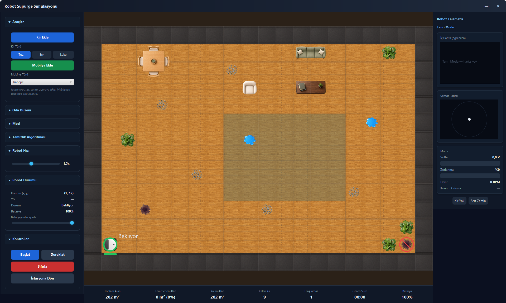
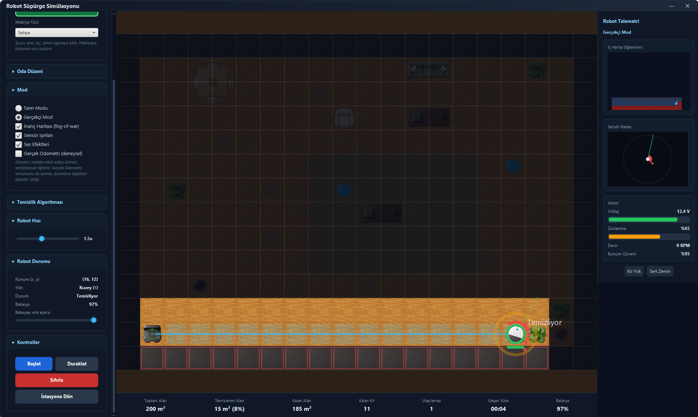
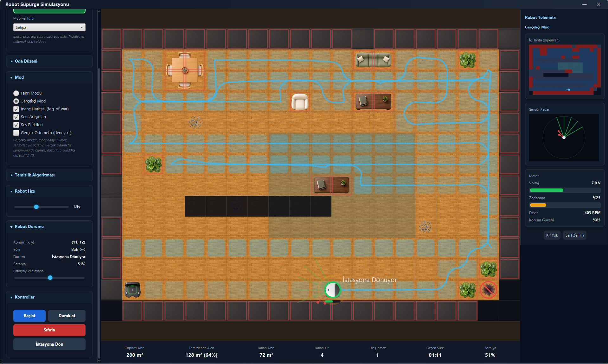
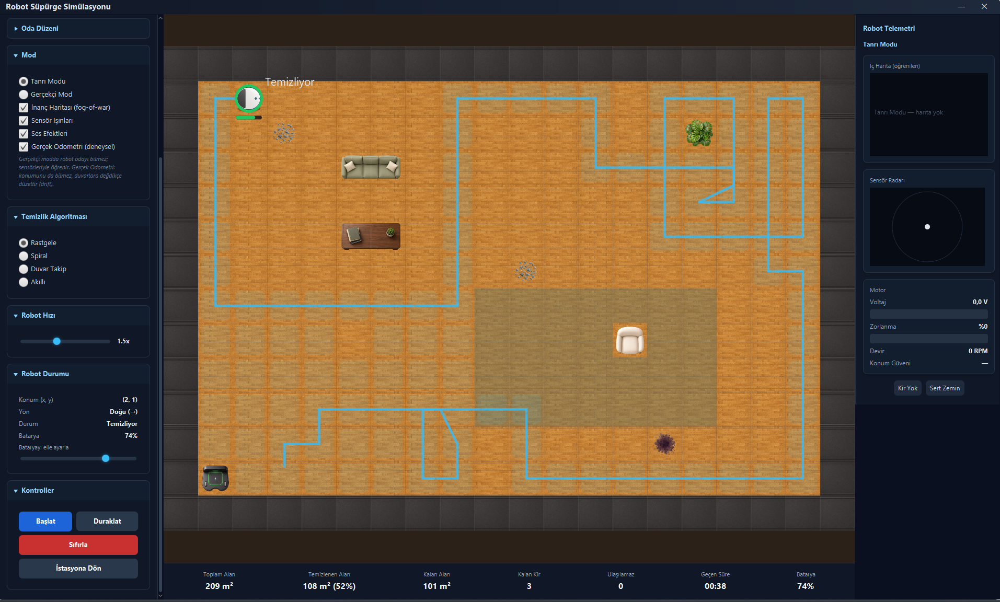
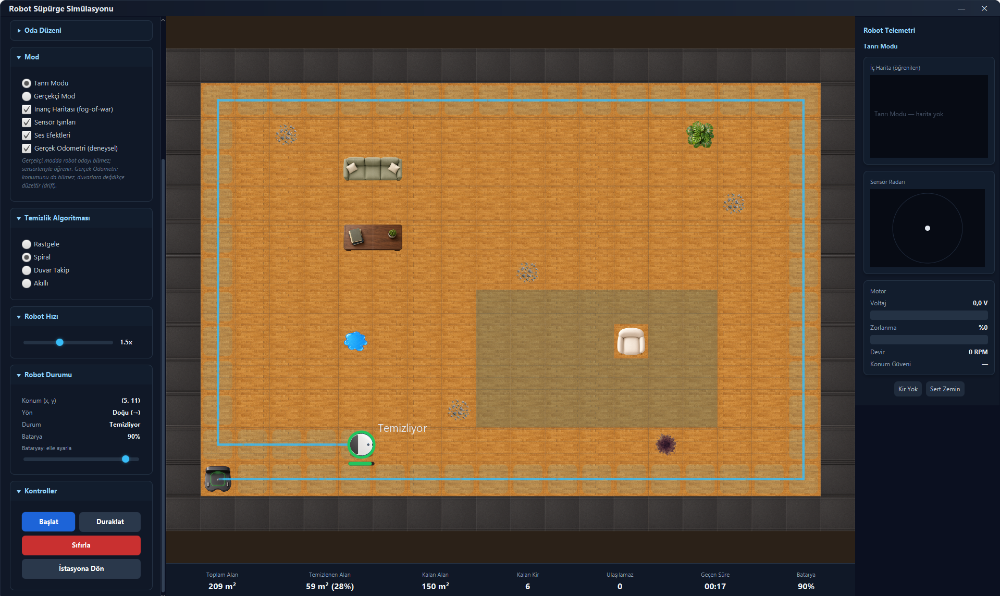
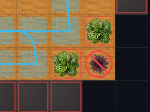

# Robot Süpürge Simülasyonu

> Otonom bir robot süpürgenin bir odada gezinerek kirleri temizlediği, engellerden
> kaçtığı, bataryasını yönettiği ve en kısa yoldan şarj istasyonuna döndüğü
> **Java + JavaFX** masaüstü simülasyonu.

Bu proje **BZ 214 Visual Programming** dersi kapsamında geliştirilmiştir. Special
thanks to the course instructor and contributors.

**Depo (GitHub):** <https://github.com/erdalgumuss/Robot-Vacuum-Simulation>



## Grup Bilgileri

**Grup:** 30

| Üye | Öğrenci No |
|-----|------------|
| Erdal Gümüş | 1030510069 |
| Melisa Şimşek | 1030510573 |
| Batuhan Pehlivanoğlu | 1030510592 |

## Öne Çıkan Özellikler

- **Oda grid'i** üzerinde robot, hareket izi, şarj istasyonu, kirler ve mobilya engelleri.
- **Üç kir tipi** (toz, sıvı, leke) — her biri farklı temizleme süresi ve batarya maliyetiyle.
- **Dört temizlik algoritması** (Strategy deseni): rastgele, spiral, duvar takip, akıllı hedefleme.
- **En kısa dönüş** (BFS/A\*): düşük bataryada veya kullanıcı komutunda şarja en kısa yoldan dönüş.
- **Tam kullanıcı kontrolü**: başlat/duraklat/sıfırla/istasyona dön, manuel batarya, hız ve oda düzeni seçimi.
- **Gerçek zamanlı telemetri**: konum, yön, batarya, kapsanan alan, kalan kir, süre.

### Bonus özellikler

- **Ulaşılamaz alan tespiti** (flood-fill) + görsel uyarı ve sayaç.
- **Çoklu oda düzeni**: oturma odası, yatak odası, stüdyo.
- **Gerçekçi mod**: robot odayı bilmeden yalnızca sensör ışınlarıyla keşfeder, kendi iç haritasını çıkarır.
- **Temizlik animasyonu** ve kapsama ısı haritası (heatmap).
- **Ses efektleri** (sentezlenmiş, dosyasız): temizleme vınlaması, şarj bipi, çarpma tıkı, bitiş melodisi.
- **Premium görsel katman**: PNG sprite'lar (robot, kir, mobilya, zemin, halı, istasyon).

## Ekran Görüntüleri

|  |  |
|:---:|:---:|
| **Gerçekçi Mod** — sis (fog-of-war) altında sensörle keşif; sağda öğrenilen iç harita ve sensör radarı. | **Kapsama ve dönüş** — serpantin temizlik izi, gelişmiş iç harita, istasyona dönüş. |
|  |  |
| **Rastgele algoritma** — dağınık kapsama izi. | **Spiral algoritma** — düzenli, içe doğru tarama. Algoritma seçimi izi belirgin biçimde değiştirir. |

**Ulaşılamaz alan tespiti:** mobilyayla çevrelenip istasyondan erişilemeyen kir kırmızı işaretle gösterilir; robot bunları beklemeden işini bitirir.



## Mimari

Proje **katı MVC** yaklaşımıyla yapılandırılmıştır. `model` ve `controller`
paketleri JavaFX'e bağımlı **değildir**; bu sayede iş mantığı arayüzden bağımsız
test edilebilir.

```text
model/       Saf veri ve durum: Room, Cell, Robot, enum'lar, stats, sensör modelleri
controller/  Simülasyon mantığı: manager, robot kontrolü, pathfinding, sürüş, algı
view/        JavaFX arayüz: Main, RoomCanvas, ControlPanel, StatusPanel, TelemetryPanel
util/        Genel sabitler
resources/   CSS ve PNG asset'ler
docs/        Rapor, gereksinim eşlemesi, rehber ve diyagramlar
```

Robotun konumu sürekli piksel koordinatlarıyla tutulur; oda ise parametrik grid
olarak modellenir. **Tanrı modunda** robot oda bilgisini stratejilerle kullanır;
**Gerçekçi modda** sensörleriyle kendi iç haritasını oluşturur.

> Sade dilde uçtan uca anlatım için: [`docs/PROJE-REHBERI.md`](docs/PROJE-REHBERI.md)

## Kurulum & Çalıştırma

Gereksinim: **JDK 21+** (JDK 24 ile test edildi), **Maven 3.9+**. JavaFX 21 Maven
ile otomatik gelir.

```powershell
git clone https://github.com/erdalgumuss/Robot-Vacuum-Simulation.git
cd Robot-Vacuum-Simulation
mvn clean compile
mvn javafx:run
```

> Not: `pom.xml` JavaFX için Windows classifier kullanır. `java` komutu eski bir
> JDK'ye gidiyorsa derlemeyi JDK 21+ ile yapın (örn. `JAVA_HOME` ayarlayarak).

## Testler

Üçüncü parti test kütüphanesi kullanmadan, **saf Java assertion** mantığıyla
`src/test/java/apptest/TestRunner.java` içinde çalışır.

```powershell
mvn test-compile
java -cp "target/classes;target/test-classes" apptest.TestRunner
```

Son doğrulama: **74 geçti, 0 kaldı**. Kapsam: BFS/A\*, erişilebilirlik, kir
temizleme süreleri, batarya yönetimi, düşük batarya dönüşü, sıfırlama, ulaşılamaz
alan, algoritma regresyonları, sensör ışınları, inanç haritası, gerçekçi mod,
motor modeli ve mod geçişleri.

## Dokümantasyon

| Dosya | Açıklama |
|------|----------|
| [`docs/report/PROJE-RAPORU.md`](docs/report/PROJE-RAPORU.md) | **Resmi proje raporu** (3 sayfa, ödev şablonu) |
| [`docs/PROJE-REHBERI.md`](docs/PROJE-REHBERI.md) | Uçtan uca, sade dil rehber — ekibin projeyi anlaması için |
| [`docs/report/REPORT.md`](docs/report/REPORT.md) | Ayrıntılı teknik rapor |
| [`docs/REQUIREMENTS.md`](docs/REQUIREMENTS.md) | Ödev maddeleri ↔ kod eşlemesi |
| [`docs/ASSETS.md`](docs/ASSETS.md) | Asset envanteri ve üretim kılavuzu |
| [`docs/report/class-diagram.puml`](docs/report/class-diagram.puml) | PlantUML sınıf diyagramı |
| [`docs/report/usecase-diagram.puml`](docs/report/usecase-diagram.puml) | PlantUML use-case diyagramı |

## Ödev Gereksinimleriyle Uyum

Zorunlu maddelerin tamamı karşılanır: JavaFX GUI, MVC, OOP + Java Collections,
grid/robot/engel/kir/istasyon/iz, kir & engel ekleme, kir tipi/hız/algoritma
seçimi, başlat/duraklat/sıfırla/istasyona dön/manuel batarya, üç kir tipi ve
farklı temizleme süreleri, batarya tüketimi ve düşük batarya dönüşü, BFS/A\* ile
en kısa rota, gerçek zamanlı durum göstergeleri. Bonuslar yukarıda listelenmiştir.
Ayrıntılı eşleme: [`docs/REQUIREMENTS.md`](docs/REQUIREMENTS.md).

## Teslim

Ödev PDF'ine göre ZIP, grup numarasıyla adlandırılır:

```text
group30.zip
```

ZIP içeriği: kaynak kod, JavaFX proje dosyaları, asset'ler, README, proje raporu,
diyagramlar ve ekran görüntüleri.
