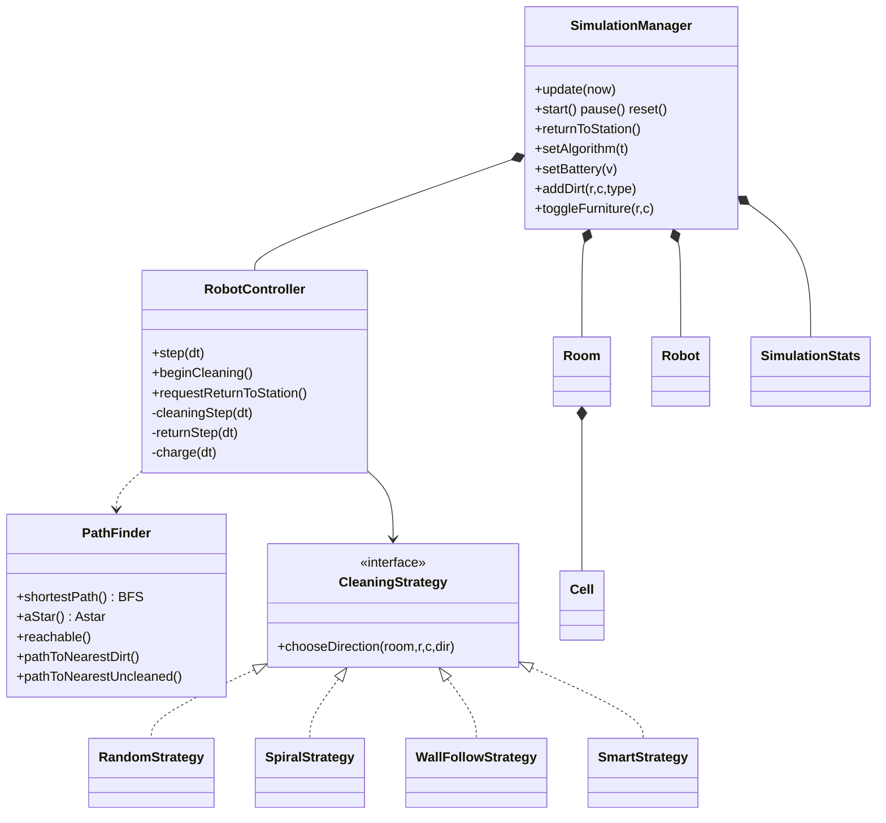
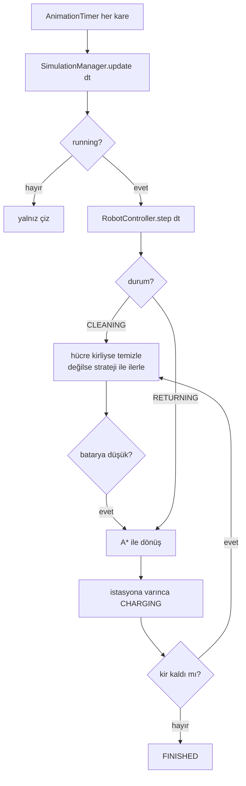

# Robot Süpürge Simülasyonu — Proje Raporu

**Ders:** BZ 214 Visual Programming
**Proje:** Robot Vacuum Cleaning Simulation (Java + JavaFX)

> Bu proje BZ 214 Visual Programming dersi kapsamında geliştirilmiştir. Derse ve
> katkıda bulunanlara teşekkürler.

---

## 1. Giriş

Bu proje, bir robot süpürgenin bir oda içinde otonom olarak gezinerek engellerden
kaçtığı, farklı kir tiplerini (toz, sıvı, leke) farklı sürelerde temizlediği,
bataryasını yönettiği ve gerektiğinde en kısa yoldan şarj istasyonuna döndüğü
bir masaüstü simülasyonudur. Uygulama **Java SE + JavaFX** ile, **katı MVC**
mimarisi ve nesne yönelimli tasarım ilkeleriyle, **hiçbir üçüncü parti kütüphane
kullanılmadan** geliştirilmiştir.

Tasarım hedefi, ödevin asgari gereksinimlerini karşılamanın ötesinde; gerçek bir
robot süpürge davranışını (akıllı hedefleme, ulaşılamaz alan tespiti, batarya
farkındalığı) ve premium bir kullanıcı deneyimini sunmaktır.

---

## 2. Gereksinim Karşılama Özeti

8 zorunlu fonksiyonel başlığın tamamı ve tüm teknik şartlar karşılanmaktadır.
Madde madde eşleme için bkz. [`../REQUIREMENTS.md`](../REQUIREMENTS.md). Kısaca:

- Grid'li oda, robot, engeller, kir, şarj istasyonu ve hareket izi çizilir.
- Kir/engel ekleme, kir türü, hız ve algoritma seçimi; başlat/duraklat/sıfırla/
  istasyona-dön ve **manuel batarya** kontrolü.
- 3 kir tipi (toz, sıvı, leke) farklı süre ve batarya maliyetiyle temizlenir.
- Robot duvar/mobilyadan geçmez, hareketle ve kir tipine göre batarya tüketir,
  düşük bataryada **A\*** ile en kısa yoldan istasyona döner.
- Konum, yön, batarya, temizlenen alan %, kalan kirli alan ve geçen süre gerçek
  zamanlı gösterilir.

---

## 3. Mimari

Proje, klasik **MVC** desenine ek olarak yönetici (manager) katmanıyla
genişletilmiştir. Kritik nokta: **`model` ve `controller` paketleri JavaFX'e
hiç bağımlı değildir** (grep ile doğrulanmıştır). Bu, iş mantığının arayüzden
tamamen ayrık olduğunu kanıtlar ve mantığın arayüz olmadan test edilebilmesini
sağlar.

```
model/       Saf veri & durum (JavaFX'siz): Cell, Room, Robot, SimulationStats, enum'lar
controller/  Mantık: SimulationManager, RobotController, PathFinder, algorithm/ (Strategy)
util/        Sabitler: SimConstants
view/        JavaFX arayüz & çizim: Main, RoomCanvas, ControlPanel, StatusPanel, ...
```

**Dünya modeli (hibrit):** Robotun konumu *sürekli* (piksel tabanlı `x, y` +
`heading`) tutulurken, oda *parametrik bir grid* olarak modellenir. Robot
kararlarını hücre merkezlerinde alır ve yalnızca yürünebilir komşu hücrelere
doğru akıcı şekilde ilerler; böylece duvar/mobilyaya asla giremez. Parametrik
grid, "çoklu oda düzeni" bonusuna da doğal zemin hazırlar.

### 3.1 Sınıf Diyagramı

Tam diyagram: [`class-diagram.puml`](class-diagram.puml) (PlantUML).
Özet (Mermaid):



### 3.2 Use-Case Diyagramı
Tam diyagram: [`usecase-diagram.puml`](usecase-diagram.puml). Aktör **Kullanıcı**;
sahne düzenleme (kir/engel), ayarlar (hız/algoritma/batarya), kontrol
(başlat/duraklat/sıfırla/istasyona-dön) ve gerçek zamanlı gözlem. Sistem tarafı
davranışlar (gezin, kaç, temizle, batarya yönet, A\* ile dön, ulaşılamaz tespit)
`<<include>>`/`<<extend>>` ile bağlıdır.

---

## 4. Sınıfların Açıklaması

### model (saf veri)
| Sınıf | Sorumluluk |
|------|-----------|
| `Direction` (enum) | 4 yön; `dRow/dCol`, açı, `turnLeft/Right/opposite`, ekran etiketi |
| `CellType` (enum) | FLOOR/WALL/FURNITURE/STATION; `isObstacle`, `isCleanable` |
| `DirtType` (enum) | DUST/LIQUID/STAIN; temizleme süresi, batarya maliyeti, renk |
| `RobotState` (enum) | IDLE/CLEANING/RETURNING/CHARGING/STUCK/FINISHED |
| `AlgorithmType` (enum) | RANDOM/SPIRAL/WALL_FOLLOW/SMART |
| `Cell` | Bir hücre: tip, kir, temizlik ilerlemesi, ziyaret durumu |
| `Room` | Parametrik grid; engel/kir/istasyon işlemleri ve sayımlar |
| `Robot` | Sürekli konum, yön, batarya, durum, hareket izi |
| `SimulationStats` | Temizlenen sayısı, başlangıç kiri, geçen süre, yüzdeler |

### controller (mantık)
| Sınıf | Sorumluluk |
|------|-----------|
| `SimulationManager` | Ana orkestratör; model'in sahibi, zaman döngüsü, tüm kullanıcı komutları |
| `RobotController` | Hareket, çarpışma, temizleme, batarya, dönüş/şarj durum makinesi |
| `PathFinder` | BFS (kısa yol), A\* (sezgisel), erişilebilirlik (flood-fill), en yakın kir/temizlenmemiş |
| `CleaningStrategy` (interface) | Gezinme stratejisi soyutlaması (+ ortak kaçış yardımcısı) |
| `RandomStrategy/SpiralStrategy/WallFollowStrategy/SmartStrategy` | 4 algoritma |
| `StrategyFactory` | Enum → strateji üretimi |

### util / view
`SimConstants` (tüm dengeleme sabitleri). View: `Main` (uygulama girişi),
`RoomCanvas` (çizim + sprite/fallback), `ControlPanel`, `StatusPanel`,
`CustomTitleBar`, `SpriteAssets` (opsiyonel PNG yükleyici), `ToolMode`.

---

## 5. Algoritmalar

### 5.1 Gezinme stratejileri (Strategy deseni)
- **Rastgele:** Ziyaret edilmemiş komşuları tercih eder, ileri devam eğilimiyle
  titremeyi azaltır.
- **Spiral:** Tutarlı sağa-dönme önceliğiyle içe doğru sarmal kapsama.
- **Duvar Takip:** Sol-el kuralı; çeperleri ve girintileri sistematik tarar.
- **Akıllı:** Her adımda en yakın kirli hücreye giden en kısa yolu (BFS) bulup
  ilk adımı izler; kiri verimli, gereksiz dolaşmadan toplar.

**Kaçış mekanizması:** Kapsama algoritmaları yerel olarak sıkışınca (tüm komşular
ziyaretli) BFS ile en yakın ziyaretsiz/kirli hücreye yönelir. Bu, deterministik
sonsuz döngüleri imkânsız kılar ve bitişi garanti eder.

### 5.2 BFS vs A\* — neden ikisi de?
- **A\*** istasyona dönüşte kullanılır: **tek hedef** olduğundan Manhattan
  sezgiseli aramayı hedefe doğru daraltır; öncelik kuyruğuyla daha az hücre açar.
- **BFS** en-yakın-kir ve erişilebilirlik (ulaşılamaz alan) aramalarında
  kullanılır: bunlar **çok hedefli / hedefsiz** taramalar olduğundan tek-hedef
  sezgiseli uygulanamaz; ağırlıksız grid'de BFS bu durumda optimaldir.

### 5.3 Ulaşılamaz alan tespiti (bonus)
İstasyondan flood-fill (`PathFinder.reachable`) ile erişilemeyen kirli hücreler
tespit edilir; arayüzde kırmızı çarpı ve "Ulaşılamaz" sayacı ile gösterilir.
Robot bu kirleri beklemeden işini bitirir (sonsuza kadar takılmaz).

---

## 6. Batarya ve Temizleme Modeli

- **Hareket:** saniyede `BATTERY_MOVE_COST_PER_SEC` (0.6%) tüketim.
- **Kir tipine göre ek maliyet:** toz 1%, sıvı 3%, leke 5% (temizleme boyunca).
- **Farklı süreler:** toz 0.8 sn, sıvı 2.5 sn, leke 4.0 sn — robot kiri
  temizlerken o hücrede bekler; kir görsel olarak solar.
- **Düşük batarya (<%20):** otomatik olarak A\* ile istasyona döner, şarj olur,
  ardından temizliğe devam eder.
- **Manuel batarya:** kullanıcı slider ile bataryayı dilediği değere ayarlayabilir.

---

## 7. Çalışma Akışı (tik döngüsü)



---

## 8. Test Stratejisi

Çekirdek iş mantığı JavaFX'siz olduğundan, **üçüncü parti kütüphane kullanmadan**
(JUnit yok — ders kuralı) saf Java assertion tabanlı bir test koşucusu yazıldı:
`src/test/java/apptest/TestRunner.java`.

**48 test** geçer; kapsananlar: yön enum'u, kir süreleri, hücre temizleme, oda
yapısı, BFS en-kısa-yol, A\*=BFS uzunluğu, erişilebilirlik & ulaşılamaz cep, en
yakın kir/temizlenmemiş, stratejilerin yürünebilir yön üretmesi, Akıllı & Spiral'in
tüm erişilebilir kiri temizleyip bitmesi (Spiral **sonsuz döngüye girmez**),
düşük-batarya dönüşü, sıfırlamanın kiri geri yüklemesi, ulaşılamaz kirin bitişi
engellememesi, robotun hücresine mobilya konulamaması.

```powershell
mvn test-compile
java -cp "target/classes;target/test-classes" apptest.TestRunner
```

---

## 9. Kurulum & Çalıştırma

Gereksinim: JDK 21+ (JDK 24 ile test edildi), Maven 3.9+. JavaFX 21 Maven ile
otomatik gelir.

```powershell
mvn clean compile
mvn javafx:run
```

---

## 10. Bonus Özellikler
- ✅ Ulaşılamaz alan tespiti (BFS reachability + görsel işaret + sayaç)
- ✅ Temizlik animasyonu (kir solma, yumuşak hareket/dönüş, temas gölgesi, kapsama heatmap'i)
- ✅ Premium görsel katman (PNG sprite, texture, halı overlay'i, fallback render)
- ✅ Çoklu oda düzeni (hazır layout şablonları + footprint'li mobilya yerleşimi)
- 🟡 Ses efektleri (`javafx-media` hazır; asset listesi `docs/ASSETS.md`)

---

## 11. Premium Görsel Katman ve Asset Üretimi

Faz 3 kapsamında arayüz, yalnızca temel Canvas şekilleriyle değil, proje içine
alınmış PNG asset'lerle de çalışacak şekilde geliştirildi. Bu katman bilinçli
olarak **opsiyonel ve hataya dayanıklı** tasarlandı: herhangi bir PNG eksikse
uygulama çökmez, aynı nesne için mevcut Canvas fallback çizimi kullanılır.

### 11.1 Üretilen asset seti

Asset üretimi için tüm görsellerde aynı temel stil kullanıldı: tepeden
ortografik bakış, modern flat tasarım, yumuşak 3B gölgelendirme, tutarlı sol-üst
ışık ve oyun asset'i okunurluğu. Şeffaf gereken nesneler chroma-key arka planla
üretilip alfa kanallı PNG'ye dönüştürüldü.

| Klasör | Dosyalar | Amaç |
|------|----------|------|
| `png/robot/` | `robot.png`, `robot_cleaning.png` | Normal ve temizlik durumundaki robot sprite'ı |
| `png/dirt/` | `dirt_dust.png`, `dirt_liquid.png`, `dirt_stain.png` | Kir tiplerinin alfa sprite'ları |
| `png/floor/` | `floor_tile.png`, `wall_tile.png`, `rug.png` | Ahşap zemin, koyu duvar ve dekoratif halı |
| `png/furniture/` | `sofa`, `coffee_table`, `armchair`, `dining_table`, `bed`, `bookshelf`, `tv_console`, `plant_small`, `plant_large`, `side_table` | Footprint'li premium oda mobilyaları |
| `png/` | `charging_station.png` | Şarj istasyonu sprite'ı |

### 11.2 Render pipeline

`SpriteAssets`, PNG dosyalarını classpath üzerinden yükleyen küçük bir asset
yöneticisidir. Yükleme sonucu cache'lenir; dosya yoksa `null` döner ve
`RoomCanvas` aynı nesne için fallback çizime geçer.

`RoomCanvas` çizim sırası şu şekilde düzenlendi:

1. Zemin/duvar texture'ları
2. Dekoratif halı overlay'i
3. Footprint'li mobilya sprite'ları
4. Kapsama heatmap'i
5. Grid çizgileri
6. Kir sprite'ları ve ulaşılamaz uyarısı
7. Robot izi, robot sprite'ı ve batarya barı

Bu sıra sayesinde halı yalnızca görsel dekor olarak kalır; robotun yol bulma,
çarpışma ve temizleme mantığını değiştirmez. Mobilyalar ise modeldeki footprint
bilgisine göre tek parça olarak çizilir; örneğin 2×1 kanepe veya 2×2 yatak tek
sprite yüzeyi gibi görünür.

### 11.3 Görsel kalite kararları

- Ana zemin tek tip ahşap tutuldu; bu, grid okunurluğunu korur.
- Halı, zemin yerine geçen bir hücre tipi değil, yalnızca dekoratif overlay'dir.
- Kir sprite'ları temizlik ilerledikçe alfa ile solar; bu, eski Canvas davranışını
  PNG görsellerle de sürdürür.
- Robot sprite'ı kuzeye bakacak şekilde üretildi; `heading` değerine göre Canvas
  tarafında döndürülür.
- Asset dosyaları `pom.xml` resource ayarlarıyla paketlenir; harici dosya yolu
  bağımlılığı yoktur.

---

## 12. Tasarım Kararları ve Sınırlamalar
- Robot, duvara hiç değmeden hücre merkezinde yön değiştirir → "çarpınca yön
  değiştir" şartı çarpışmasız ve sağlam karşılanır.
- Zorunlu dönüş sırasında temizlik yapılmaz (düşük batarya aciliyeti); CLEANING
  modunda üstünden geçilen her kir temizlenir.
- Batarya %0'da robot yine de istasyona ulaşır (kullanıcıyı kilitlememek için).

---

## 13. Sonuç
Proje, ödevin tüm zorunlu gereksinimlerini ve iki bonusu karşılayan, katı MVC ve
temiz OOP ile yazılmış, otomatik testlerle korunan bir simülasyondur. Mimarisi,
kalan bonusların (çoklu oda, ses) ve görsel zenginleştirmelerin düşük maliyetle
eklenmesine olanak tanır.
